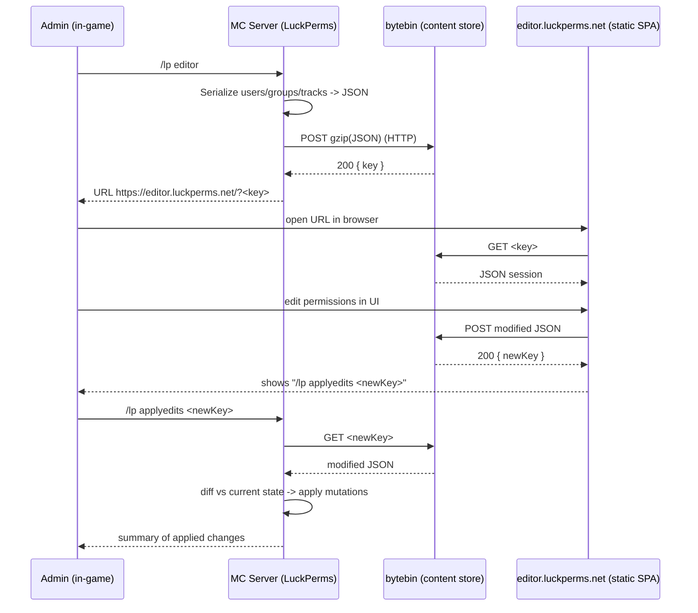
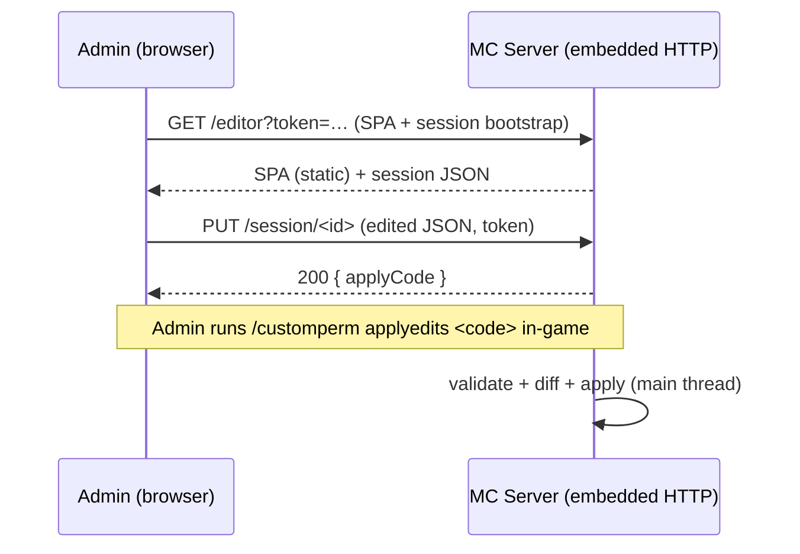

# CustomPerm — Web Admin Panel Design Specification

> **Status:** Design only — not implemented. This document is the reference blueprint for
> building a LuckPerms-style online admin panel ("web editor") for CustomPerm, later.
> **Target loader:** NeoForge 1.21.1 (`neo_version=21.1.221`), Java 21, server-side only.
> **Author:** THEFricadelle
> **No version bump** is implied by this document; versioning happens when implementation starts.

---

## 0. Motivation

CustomPerm already runs in two backends:

- **Standalone / autonomous** — internal grades (`grades.json`), no external dependency.
- **LuckPerms-delegated** — permission checks resolved by LuckPerms; grade subcommands are disabled
  (`CustomPermCommand.warnIfLuckPerms`) and users are managed via `/lp`.

LuckPerms ships a first-class online editor (`/lp editor`). In autonomous mode CustomPerm has **no
equivalent** — admins must use in-game text commands (`/customperm grade ...`, `alias`, `ratelimit`,
`command`) or the optional TesseraUI in-game GUI. The goal is a **web panel comparable to the LP
editor** so autonomous mode reaches feature parity for administration UX, while staying safe and
respecting the mod's "server-side only, never break vanilla clients" guarantee.

---

## 0.1 Amendment — the in-game LuckPerms editor

This document was written when the answer to "how do I administer LuckPerms without a browser"
was "you don't, use `/lp`". That is no longer true: the TesseraUI panel now carries an in-game
LuckPerms editor (`/customperm gui luckperms`) covering groups, users, tracks, permission nodes
with contexts and expiry, meta and chat meta, writing through the LuckPerms API server-side and
gated by `customperm.gui.luckperms.edit`.

What that changes here:

- **Goal 3 is narrowed.** In LuckPerms mode the panel no longer delegates *everything* about
  users and groups to `/lp`. The web panel described below still confines itself to
  CustomPerm-owned config, but the delegation is now a scope decision for *this* document, not a
  statement about the mod as a whole.
- **The first non-goal is narrowed too.** Replacing `/lp editor` remains out of scope *for the
  web panel*; in-game, CustomPerm now offers a comparable surface.
- **Option C is no longer only "complementary".** The comparison table in §3 dismissed extending
  TesseraUI as "not a web panel; limited layout". The first half stands — this is not a browser.
  The second does not: TesseraUI 1.1 ships text inputs, dropdowns, checkboxes, tabs and virtual
  lists, which is enough for a real editor. Option B remains the choice for a *web* panel; Option
  C turned out to be the cheaper route to the actual goal (feature parity for administration UX)
  and shipped first.

Nothing else in this document is affected: the embedded-server design, the token model, the
diff-based apply and the storage decisions all still describe the web panel as planned.

---

## 1. Goals & Non-Goals

### Goals
1. Browser-based admin panel to view and edit: grades, user→grade assignments, allow/deny permission
   nodes, exposed commands, aliases (+ steps), rate limits, and settings.
2. Mirror the LuckPerms UX round-trip: `/customperm editor` → URL → edit in browser →
   `/customperm applyedits <code>` in-game.
3. Work in **both** backends: full editing in standalone mode; CustomPerm-owned config only
   (commands/aliases/ratelimits/settings) in LuckPerms mode, delegating grade/user editing to `/lp`.
   *(Superseded in part — see §0.1.)*
4. **Server-side only.** No client-side mod requirement; a vanilla client must still connect.
   The panel lives in the admin's browser, fully out-of-band.
5. **Self-hostable** storage + front-end (the mod is proprietary/source-available and exports contain
   player data — see §9).
6. **Safe by construction**: op-2 gated, ephemeral sessions, diff-based apply, input-validated,
   concurrency-aware, all HTTP off the server main thread.

### Non-Goals (v1)
- Replacing `/lp editor` for LuckPerms user/group management *from the browser*. (An in-game
  equivalent now exists — see §0.1.)
- Real-time multi-admin collaborative editing (optional future — §6.6, websocket).
- A **public, account-based, always-on** admin portal. v1 does run a lightweight embedded HTTP server
  (§17), but it is **loopback-by-default, one-time-token, opt-in, and only listens while enabled** — not a
  multi-user authenticated web app.

---

## 2. Reference: How the LuckPerms Web Editor Works

The model we mirror. LuckPerms' editor is a **stateless round-trip through a content-storage service**,
not a live connection to the game server.



### Key properties to reproduce
- **bytebin** — a small, open-source (MIT), stateless HTTP content store by lucko. `POST` stores a blob
  (gzip, arbitrary content-type) and returns a short random **key**; `GET /<key>` returns it. Content
  expires after a TTL. **Self-hostable** (Docker). Public instance: `https://bytebin.lucko.me`.
- **webeditor** — an open-source (MIT) static single-page app. No server-side logic; it only talks to
  bytebin. **Self-hostable** (static files). Public instance: `https://editor.luckperms.net`.
- **Authorization** is purely in-game: anyone can *open* a read-only-ish session URL, but only an
  **op** who runs `applyedits` in-game can write changes back to the server. The key is a
  bearer-capability to the *blob*, not to the server.
- **Apply = diff**, not overwrite: the server compares the returned document against current state and
  applies the delta, so concurrent unrelated changes are less likely to be clobbered.
- **(Optional) live sync** — a newer LP feature uses a websocket mediator (`bytesocks`) so the editor
  and server push changes to each other in real time. Out of scope for v1.

---

## 3. Architecture Options

| Option | Summary | Pros | Cons | Verdict |
|---|---|---|---|---|
| **A. bytebin round-trip + static SPA** (mirror LP) | Server exports JSON, uploads to a bytebin, admin edits in a hosted static SPA, `applyedits` downloads + diffs. | No open inbound port; matches a proven model; SPA is trivially self-hostable; HTTP is short-lived & outbound only. | Requires outbound HTTPS from the server; needs a hosted bytebin + SPA (self or public); breaks on egress-firewalled/offline/LAN/singleplayer; not real-time. | **DEFERRED** — future `mode="bytebin"` (§17.2, P6). |
| **B. Embedded local HTTP server** | The mod runs a small loopback HTTP server that serves the SPA and stores/serves sessions; writes still go through in-game `applyedits`. | Fully offline/self-contained (no third party, no egress); works on LAN/singleplayer/firewalled; no separate infra; JDK-only. | Runs a local listener (mitigated: loopback-by-default, one-time token, opt-in); remote access needs an SSH tunnel/proxy. | **CHOSEN for v1** (loopback, token-gated — see §17). |
| **C. In-game GUI only** (extend TesseraUI) | Keep everything in Minecraft screens. | No web at all; already partially built. | Not a "web panel"; limited layout; requires TesseraUI client-side. | Complementary, **not a substitute**. |

**Decision (confirmed):** implement **Option B** — a lightweight, loopback-by-default, token-gated
embedded server (§17). It keeps the mod fully self-hosted with **zero external infra**, works
**offline/LAN/singleplayer and behind egress firewalls**, and never opens a public port by default. Writes
remain authorized solely by in-game op-2 `applyedits`, so the HTTP layer is a courier, not an admin API.
**Option A (bytebin) is deferred** as a forward-compatible future mode for remote editing without a tunnel.

---

## 4. End-to-End Flow (Option A, CustomPerm)

New commands (see §11):

```
/customperm editor [section]      # export current config, upload, print editor URL
/customperm applyedits <code>     # download edited doc, diff, apply, resync
```

The **v1 flow is the embedded-server variant in §17.2** (the mod itself serves the SPA and stores the
session over loopback); the §2 bytebin round-trip is the conceptual reference model and the deferred
`mode="bytebin"` future. Either way the same two implementation-critical rules hold:

- **All HTTP runs off the server main thread** (async `HttpClient`), and the **apply step returns to the
  main thread** via `server.execute(...)` before mutating config or the command dispatcher — exactly the
  pattern already used for LuckPerms resync in `LuckPermsService.initServerHooks`. This preserves the
  "checks/mutations happen on the tick thread, and nothing blocks it" invariant.
- **Apply is a validated diff**, never a blind overwrite (see §5.3, §9).

---

## 5. Data Model — Editor Session JSON

### 5.1 Design rules
- **Versioned**: top-level `schemaVersion` (start at `1`). The applier rejects unknown major versions.
- **Backend-aware**: `meta.backend` = `"internal"` | `"luckperms"`. In `luckperms` mode, grade/user
  sections are exported **read-only** (`meta.readOnly` lists them) and the applier refuses to write them.
- **Conflict-detectable**: `meta.configHash` = a stable hash (e.g. SHA-256 over the canonical JSON of the
  current `ConfigSnapshot`). On `applyedits`, if the live config's hash differs from
  `meta.baseConfigHash`, the applier warns and (configurable) either aborts or performs a 3-way merge.
- **Self-describing**: field names map 1:1 to config classes so the exporter/applier stay trivial.

### 5.2 Schema (canonical example)

```json
{
  "schemaVersion": 1,
  "meta": {
    "mod": "customperm",
    "modVersion": "1.0.5",
    "serverName": "My SMP",
    "backend": "internal",
    "exportedAt": "2026-07-27T18:22:05Z",
    "exportedBy": { "uuid": "…", "name": "THEFricadelle" },
    "baseConfigHash": "sha256:…",
    "readOnly": [],
    "sessionNonce": "…random…"
  },
  "grades": [
    { "name": "moderator",
      "allow": ["customperm.command.kick", "customperm.command.ban", "customperm.alias.warn"],
      "deny":  ["customperm.command.stop"] }
  ],
  "users": [
    { "uuid": "…", "name": "Steve", "grades": ["moderator"] }
  ],
  "commands": {
    "granted": ["kick", "ban", "gamemode"],
    "preserveOriginalRequires": { "gamemode": true }
  },
  "aliases": [
    { "name": "warn", "steps": ["tellraw @a {\"text\":\"…\"}", "playsound …"] }
  ],
  "rateLimits": [
    { "command": "gamemode", "enabled": true, "maxExecutions": 5, "windowSeconds": 60 }
  ],
  "settings": {
    "luckPermsFallbackMode": "deny"
  }
}
```

### 5.3 Mapping to config classes

| JSON section | Source (`ConfigSnapshot`) | Notes |
|---|---|---|
| `grades[]` | `GradesConfig.grades` (`Grade.name/permissions/deniedPermissions`) | `allow`←`permissions`, `deny`←`deniedPermissions`. |
| `users[]` | `GradesConfig.userGrades` (UUID→grade list) | `name` best-effort resolved from usercache/online players; informational only. |
| `commands` | `CommandsConfig.grantedCommands` + `preserveOriginalRequires` | |
| `aliases[]` | `AliasesConfig.aliases` (name→steps) | |
| `rateLimits[]` | `RateLimitsConfig.rules` (`Rule.enabled/maxExecutions/windowSeconds`) | |
| `settings` | `SettingsConfig` | Only whitelisted fields (see §9 — never apply arbitrary keys). |

### 5.4 Apply (diff) semantics
For each section, the applier computes **add / remove / change** against the live snapshot and reuses the
existing mutation paths and invariants rather than writing files directly:

- **commands.granted**: added names → same checks as `commandAdd` (command must exist in dispatcher,
  cannot be `customperm`), then `CommandTreeRewriter.repair` + `reassertExposedCommands`; removed names →
  `commandRemove` path (restore original requires). Then one `sendCommands` resync.
- **aliases**: added/changed → `AliasManager.registerOrReplace` + shadowing warning; removed →
  unregister + `repair`.
- **rateLimits**: `RateLimitsConfig.rules` put/remove + `normalize()`.
- **grades/users**: internal-mode only; refuse in LP mode. Reuse `PermissionResolver`-compatible shapes.
- Finally `configManager.save()` + backup (existing atomic write path) + resync.

---

## 6. Server-Side Components (new)

All new classes live under `com.arcadia.customperm.webeditor`.

### 6.1 `WebEditorService` (orchestrator)
- `CompletableFuture<String> createSession(ConfigSnapshot, meta)` → returns editor URL.
- `CompletableFuture<ApplyResult> applyEdits(String code, MinecraftServer)`.
- Owns the `HttpClient`, the config, and thread-hopping discipline.

### 6.2 `EditorSessionExporter`
- Pure function `ConfigSnapshot → JsonObject` (Gson, already a dependency). No Minecraft imports except
  the optional player-name resolution helper (kept injectable for unit tests, like `ConfigManager`).
- Computes `baseConfigHash`.

### 6.3 `EditorSessionApplier`
- `JsonObject → List<Mutation>` (diff) then executes mutations on the **main thread**.
- **Validation gate first** (§9): reject the whole document on any invalid field; never partial-apply
  silently (report which entries were rejected).

### 6.4 `BytebinClient` (DEFERRED — Option A / P6 only)
> Not part of v1. The v1 courier is the embedded `HttpServer` (§17.3). This client is only built if/when
> `webeditor.mode = "bytebin"` is implemented for remote self-hosted setups.
- `java.net.http.HttpClient` (JDK built-in — **no new Gradle dependency**).
- `POST` gzip body, `Content-Type: application/json`, `Content-Encoding: gzip`, parse `{ "key": … }`
  (bytebin returns the key in the `Location`/body depending on instance — implement per chosen instance).
- `GET /<key>` → decode.
- Hard **timeouts** (connect + request), **max body size** guard on download, all **async**.
- Base URLs come from config (§10); default points at a self-hosted instance placeholder.

### 6.5 Command wiring
- Extend `CustomPermCommand.register` with `editor` and `applyedits` literals, gated by the **same real-op
  check** already used for the root (`player.createCommandSourceStack().hasPermission(2)`).
- Reuse `RateLimiter` to throttle `editor` (anti-spam on uploads) — dogfoods the existing limiter.

### 6.6 (Optional, later) Live sync
- Websocket mediator (bytesocks-style) for two-way live editing. Additive; not required for v1.

### 6.7 Threading contract (must-hold)
```
editor:      main thread (parse args) → async (export off-thread is fine; it's pure) → async HTTP POST
                → main thread (print URL via server.execute)
applyedits:  main thread (parse args) → async HTTP GET → async validate+diff (pure)
                → main thread (apply mutations + save + resync) via server.execute
```
No blocking network call ever executes inside a Brigadier command callback on the tick thread.

---

## 7. Web Front-End (static SPA)

- **Tech**: a self-contained static site (HTML + vanilla JS or a small framework), no external CDN
  (CSP-friendly), no telemetry. Reuse the visual style already present in
  `assets/customperm/ui/status.html`.
- **Sections**: Grades, Users, Commands, Aliases, Rate Limits, Settings — driven entirely by the session
  JSON; the SPA is schema-version aware.
- **Backend awareness**: when `meta.backend == "luckperms"`, the Grades and Users tabs render read-only
  with a banner: *"Managed by LuckPerms — use `/lp editor`."* Only CustomPerm-owned tabs are editable.
- **Output**: on save, `POST` to the same bytebin and display the exact `/customperm applyedits <code>`
  string to copy.
- **Origin (decision #2 — hybrid)**: fork LP's MIT `webeditor` as the base for the **Grades / Users /
  Permissions** experience (it already models allow/deny nodes, group membership, wildcards, and a good
  node-picker UX), then add **bespoke tabs** for the concepts LP's editor has no notion of:
  **Exposed Commands**, **Aliases** (ordered multi-step editor), **Rate Limits**, and **Settings**. The
  fork's LP-specific serialization is replaced by CustomPerm's schema (§5); attribution to the MIT
  `webeditor` is preserved in the SPA. The bespoke tabs are original CustomPerm work.
- **Hosting**: ship the static files in the repo under `webeditor/`. Two supported deployments (see §17):
  (a) **served directly by the mod's embedded server** (self-hosted default, zero extra infra); (b) any
  static host paired with a self-hosted bytebin. The SPA is a separate deliverable from the mod jar, so
  its MIT lineage does not affect the mod's proprietary license.

---

## 8. Dual-Backend Behavior

| Section | Standalone (`internal`) | LuckPerms (`luckperms`) |
|---|---|---|
| Grades | **Editable** | Read-only (delegate to `/lp editor`) |
| Users → grades | **Editable** | Read-only (delegate to `/lp`) |
| Exposed commands | **Editable** | **Editable** (nodes resolved by LP at runtime) |
| Aliases | **Editable** | **Editable** |
| Rate limits | **Editable** | **Editable** |
| Settings | **Editable** | **Editable** |

Defense in depth: even if a tampered document contains grade/user edits while `backend == luckperms`,
the **applier refuses** those sections (mirrors `warnIfLuckPerms` which already blocks grade subcommands).

---

## 9. Security Model

1. **Authorization** — `editor` and `applyedits` require **real op level 2** (reuse the existing
   non-elevated check so an alias running at op-4 cannot self-authorize; see the comment block at
   `CustomPermCommand.register`).
2. **Capability, not identity** — the bytebin key is a bearer capability to a *blob*, never to the server.
   Reading a session grants no server write; only in-game `applyedits` by an op writes.
3. **Ephemerality** — short TTL on bytebin content; random keys; optional `sessionNonce` echoed back and
   verified once, then invalidated (prevents replay of an old `applyedits`).
4. **Transport** — HTTPS required for any non-localhost bytebin. Self-hosting strongly recommended.
5. **Data sensitivity (PII)** — exports contain **player UUIDs and names** and your permission topology.
   Treat as sensitive; default to **self-hosted** bytebin; document that using a public instance uploads
   this data to a third party. `enabled=false` by default (opt-in).
6. **Strict input validation before apply** (never trust fetched content — aligns with the project's
   website-instruction-safety rule): grade/alias/command names against a safe regex; permission nodes
   against the node grammar; alias steps sanitized (no leading slash, no `/customperm` reserved shadowing
   rule already enforced in `aliasAdd`); integer bounds on rate limits (`max>=1`, `window>=1`); reject
   unknown settings keys (whitelist only). Any violation rejects that entry and is reported; the apply is
   all-or-nothing per section where feasible.
7. **Conflict detection** — compare `meta.baseConfigHash` to the live config hash; on mismatch, abort by
   default (configurable to 3-way merge) so a stale editor session can't silently revert newer changes.
8. **Anti-spam** — `editor` is rate-limited (reuse `RateLimiter`) to cap upload frequency per admin.
9. **No inbound port** — Option A never listens; it only makes outbound calls. (Option B would add a
   port and therefore auth/TLS/CSRF requirements — deferred.)

---

## 10. Config Additions

New file `webeditor.json` (kept separate so it hot-reloads and backs up like the others), or a nested
block in `settings.json`. Proposed `WebEditorConfig`:

```json
{
  "enabled": false,
  "mode": "embedded",

  "// embedded mode (§17)": "",
  "bindAddress": "127.0.0.1",
  "port": 8765,

  "// bytebin mode (§2, §3 Option A)": "",
  "bytebinUrl": "https://bytebin.example.com",
  "editorUrl":  "https://customperm-editor.example.com",

  "// shared": "",
  "sessionTtlMinutes": 60,
  "maxDownloadBytes": 2097152,
  "httpTimeoutSeconds": 10,
  "exportPlayerNames": true,
  "abortOnConcurrentChange": true
}
```

- `mode`: `"embedded"` (default, §17 — loopback HTTP server) or `"bytebin"` (§3 Option A — external
  self-hosted store). `bindAddress`/`port` apply to embedded; `bytebinUrl`/`editorUrl` apply to bytebin.
- `exportPlayerNames` (§18): `true` includes names (safe under embedded/loopback), `false` = UUID-only.
- Add to `ConfigSnapshot`, `ConfigManager` (parse/save/backup like the existing five files), and the
  all-or-nothing reload transaction (INVARIANT-401), per the touch points in §19.3. Provide `normalize()`
  with safe defaults (validate `mode`, clamp `port`/timeouts, force `bindAddress` to a sane value).
- **Do not** ship real public URLs enabled by default (privacy + opt-in); embedded defaults to loopback.
- (JSON comments above are illustrative; the real file is plain JSON — Gson tolerates no comments.)

---

## 11. Command Reference (new)

| Command | Op | Effect |
|---|---|---|
| `/customperm editor` | 2 | Export full config, upload, print editor URL. |
| `/customperm editor <section>` | 2 | Same, but the SPA opens focused on `grades\|users\|commands\|aliases\|ratelimits\|settings`. |
| `/customperm applyedits <code>` | 2 | Download edited doc, validate, diff, apply, save, resync; print a change summary. |

Both are also gated by `enabled=true` in `WebEditorConfig`; when disabled they print a hint explaining how
to enable and the privacy implications.

---

## 12. Implementation Plan (phased)

v1 uses the **embedded server (§17)** as the courier — there is **no `BytebinClient` in v1**.

| Phase | Deliverable | Key files | Invariants to preserve |
|---|---|---|---|
| **P0** | `WebEditorConfig` + `webeditor.json` wired into `ConfigManager`/`ConfigSnapshot` | `WebEditorConfig`, `ConfigManager`/`ConfigSnapshot` edits (§19.3) | INVARIANT-401 (all-or-nothing reload); atomic write; backup rotation. |
| **P1** | Embedded `HttpServer` (loopback) + exporter + `/customperm editor` (serve SPA + session, print tokened URL) | `webeditor.http.EmbeddedServer`, `EditorSessionExporter`, `WebEditorService`, command wiring | Off-tick HTTP thread pool; op-2 gate; opt-in enable; loopback bind; one-time token. |
| **P2** | `/customperm applyedits` for CustomPerm-owned sections (commands/aliases/ratelimits/settings) | `EditorSessionApplier` (diff), validation, `baseConfigHash` abort (§20) | Reuse `commandAdd/Remove`, `AliasManager`, `reassertExposedCommands`, resync; main-thread apply. |
| **P3** | Grades + users editing (standalone) + `exportPlayerNames` handling (§18) | applier grade/user diff | `PermissionResolver` shapes; save/backup. |
| **P4** | LuckPerms-mode read-only + delegation + defense-in-depth refusal | backend gating in exporter/applier | Mirror `warnIfLuckPerms`. |
| **P5** | Hybrid SPA front-end (LP `webeditor` fork + bespoke tabs, §7) | `webeditor/` | CSP; same-origin only; no external calls. |
| **P6 (deferred)** | Optional Option A (`BytebinClient`, `mode="bytebin"`), live websocket sync, 3-way merge (§20.4) | — | Additive; off-thread HTTP; auth/TLS if ever inbound. |

Each phase ships with tests (§13) and a CHANGELOG entry; **no version bump** until the owner requests one.

---

## 13. Testing Strategy

- **Unit (pure Java, no Minecraft — like `RateLimiterTest`/`PermissionResolverTest`):**
  - Exporter round-trip: `snapshot → JSON → snapshot` is identity for internal mode.
  - `baseConfigHash` stability & sensitivity.
  - Applier diff: add/remove/change per section; all-or-nothing on invalid entry.
  - Validation rejects: bad names, bad nodes, out-of-range limits, unknown settings keys,
    `customperm` shadowing, grade edits under `backend=luckperms`.
  - Embedded server: hit its endpoints via an in-process HTTP client against a loopback bind on an
    ephemeral port — `GET /api/session/<id>` returns the export; `PUT` stores and returns an `applyCode`;
    requests without a valid token are rejected.
- **GameTest (`src/gameTest`):** `editor` requires op-2 (non-op denied); `applyedits` mutates the live
  dispatcher and triggers `sendCommands`; conflict-hash mismatch aborts.
- **Security tests:** malformed/oversized payload rejected; replay of a used `sessionNonce`/token refused;
  non-loopback request refused when `bindAddress` is loopback; `Origin`/`Sec-Fetch-Site` guard on `PUT`.

---

## 14. Decisions Log

**All six decisions are CONFIRMED.** The spec below is final for v1; implementation follows §12.

| # | Topic | Decision (final) | Detail |
|---|---|---|---|
| 1 | **Storage hosting** | **Self-hosted, via the mod's own embedded server** (resolved together with #3 — no separate bytebin infra to run). A self-hosted bytebin container is an *optional, deferred* alternative, not part of v1. | §9, §10, §17 |
| 2 | **SPA origin** | **Hybrid**: fork LP's MIT `webeditor` for grades/users/permissions, add **bespoke tabs** for CustomPerm-only concepts (exposed commands, aliases, rate limits, settings). | §7 |
| 3 | **Connectivity / offline** | **Option B — embedded loopback HTTP server** is the chosen, default (and v1-only) path. Works offline, LAN, singleplayer, and behind egress firewalls; no inbound public port. The bytebin round-trip (Option A) is **deferred** (optional future for remote-without-tunnel setups). | §17 |
| 4 | **PII policy** | **Data minimization + configurable pseudonymization.** `exportPlayerNames=true` default (safe because storage is loopback/local); UUID-only mode available. | §18 |
| 5 | **Config placement** | **Separate `webeditor.json`**, matching the existing per-concern file split and the INVARIANT-401 reload transaction. | §19 |
| 6 | **Conflict policy** | **Abort-on-mismatch by default** (`abortOnConcurrentChange=true`). Opt-in 3-way merge is a deferred enhancement. | §20 |

Consequence for v1 scope: the **`BytebinClient` / Option A path is out of v1** — the courier is the
embedded `HttpServer`. Option A remains documented (§2–§3, §17.2) as a forward-compatible future mode
selected by `webeditor.mode = "bytebin"`, but is not built in the initial phases.

---

## 15. Dependencies & Licensing

- **Server side (Option A): no new Gradle dependency.** Uses JDK `java.net.http.HttpClient` +
  `java.util.zip.GZIPOutputStream` and the already-present Gson.
- **bytebin** (MIT, self-hostable, Docker) — infrastructure, not bundled in the mod jar.
- **webeditor** (MIT) — if adapted, keep the MIT attribution in the SPA; it is a **separate deliverable**
  from the proprietary mod jar and does not affect the mod's license.
- CustomPerm itself remains **proprietary, source-available (All Rights Reserved)**; any self-hosted
  third-party component keeps its own license.

---

## 17. Connectivity, Offline & Firewalled Servers (decision #3)

### 17.1 The problem
Option A (§3) needs **two** network reachabilities:
1. **Server → storage** — the game server must make an outbound HTTPS call to upload/download sessions.
2. **Admin browser → storage + SPA** — the admin's browser must reach the storage and the SPA.

Real deployments break these assumptions:
- **Egress-firewalled** hosts (many managed/hosting providers block outbound HTTP from game servers).
- **Air-gapped / LAN-only** servers with no internet at all.
- **Singleplayer / Open-to-LAN** worlds (§ the mod already supports these) — there is no public endpoint,
  and running external infra is absurd for one player.
- **Privacy** — decision #1 is self-hosted; the fewer moving parts, the smaller the trust surface.

### 17.2 Chosen approach: embedded server (Option B) — CONFIRMED, v1
Because storage is self-hosted anyway (decision #1), the simplest self-hosting is **no separate infra at
all**: the mod runs a **tiny embedded HTTP server** that both **serves the SPA** and **stores/serves
sessions** (acts as a local one-endpoint bytebin). This collapses the two reachabilities into one and
works offline, on LAN, and in singleplayer. **This is the v1 path.**



The bytebin round-trip (Option A) is **deferred** — kept as a forward-compatible future mode
(`webeditor.mode = "bytebin"`) for admins who later want to edit from a remote machine without a tunnel by
self-hosting a bytebin + SPA elsewhere. It is not built in v1.

### 17.3 Embedded-server design (`com.arcadia.customperm.webeditor.http`)
- **Implementation**: JDK built-in `com.sun.net.httpserver.HttpServer` (no new dependency; already used in
  unit tests as a stub — §13). Runs on its own small thread pool, **never** on the game tick thread.
- **Lifecycle**: start on `ServerStartedEvent` **only if** `webeditor.enabled` and
  `webeditor.mode == "embedded"`; stop on `ServerStoppedEvent`. Mirrors the existing hook style in
  `CustomPerm` (which already listens to `ServerStartedEvent`/`ServerStoppedEvent`).
- **Bind address (default safe)**: `127.0.0.1` (loopback only). To reach it remotely, the admin uses an
  **SSH tunnel** (`ssh -L 8765:127.0.0.1:8765 …`) or a reverse proxy they control — the mod does **not**
  expose a public port by default. A `bindAddress` config allows LAN binding for trusted networks.
- **Port**: configurable (`webeditor.port`, default e.g. `8765`); if taken, log and disable gracefully.
- **Endpoints** (minimal REST):
  - `GET  /` and `/assets/*` → the static SPA (served from the mod jar resources / `webeditor/`).
  - `GET  /api/session/<id>` → the exported JSON for that session (token-guarded).
  - `PUT  /api/session/<id>` → store an edited JSON, return an `applyCode` (token-guarded).
  - No endpoint mutates game state directly — **writes still require in-game `/customperm applyedits`**
    (keeps op-2 as the single authorization authority; the HTTP layer is a courier, not an admin API).
- **Threading**: HTTP handlers only read the current `ConfigSnapshot` (atomic) and buffer session blobs in
  memory; the actual apply happens later, on the main thread, triggered by the in-game command.

### 17.4 Authentication & hardening (embedded)
- **One-time capability token**: `/customperm editor` generates a random token, embeds it in the printed
  URL (`http://127.0.0.1:8765/?t=<token>`), and binds it to a session id with a short TTL. The HTTP server
  accepts only requests carrying a valid, unexpired token.
- **Loopback-by-default** dramatically shrinks the attack surface (no remote reachability without an
  explicit tunnel/proxy the operator sets up).
- **CSRF/same-origin**: the SPA and API share the mod's own origin; enforce `Origin`/`Sec-Fetch-Site`
  checks on `PUT`, and require the token in a header (not just a cookie).
- **No TLS termination in-mod**: loopback needs none; for remote access the operator's tunnel/reverse
  proxy provides TLS. Document this explicitly (don't roll our own TLS).
- **Body/size/timeout limits** identical to the `BytebinClient` guards (§6.4).
- Still **opt-in** (`enabled=false` default) and **op-2** for the in-game commands.

### 17.5 Decision matrix

| Scenario | Recommended mode |
|---|---|
| Singleplayer / Open-to-LAN | **Embedded**, loopback (or LAN bind for the host). |
| Dedicated server, admin on same box / via SSH | **Embedded**, loopback + SSH tunnel. |
| Dedicated server, egress-firewalled | **Embedded** (no outbound needed). |
| Admin wants to edit from anywhere, has own infra | **Bytebin (Option A)** with self-hosted bytebin + SPA. |
| Managed host, no shell access, outbound allowed | **Bytebin (Option A)**. |

**Config**: `webeditor.mode = "embedded" | "bytebin"` selects the path (§19 shows the full config).

---

## 18. Player Data & Pseudonymization (decision #4)

### 18.1 What the export contains
Only two sensitive fields: **player UUIDs** and **player names**, and only for users who actually have a
grade assignment (`GradesConfig.userGrades` is already sparse — unassigned players are never listed). The
permission *topology* (grade names, nodes) is not personal data.

### 18.2 Principles (defense in depth, even when self-hosted)
Self-hosting (decision #1) already keeps data on the operator's own infra, so the third-party-upload risk
is gone. Pseudonymization still matters for: browser history, screen-sharing/screenshots, shared admin
machines, and session blobs at rest. Apply **data minimization**:

1. **Minimize scope** — export only assigned users (already the case). Never export the full player list.
2. **UUID is the key; name is a convenience** — the applier keys everything on UUID; names are display-only
   and never used to resolve identity on apply.
3. **Configurable name handling** (`webeditor.exportPlayerNames`):
   - `true` (default when embedded/loopback) — include names, resolved from the server's
     `GameProfileCache` / usercache for good UX.
   - `false` — export UUID-only; the SPA shows a short UUID prefix, and the operator can paste a local
     name map if desired. No names ever leave the game process.
4. **Short retention** — embedded sessions live in memory with a TTL and are dropped on server stop;
   bytebin blobs use a short TTL. No long-term store of exports.
5. **No logging of PII** — the mod logs session ids and counts, never names/UUIDs at INFO.

### 18.3 Recommendation
Ship with `exportPlayerNames=true` **because** the default storage is embedded/loopback (decision #1 + #3),
where names never leave the host. Document that operators who enable a networked mode or a remote bytebin
should set `exportPlayerNames=false` and treat exports as personal data (retention, access control). This
is a pragmatic middle ground: best UX where it's safe, easy hardening where it isn't.

---

## 19. Config Placement (decision #5)

### 19.1 Options
- **A — separate `webeditor.json`** alongside the existing five files
  (`grades/aliases/commands/settings/ratelimits.json`).
- **B — nested block inside `settings.json`** (which today holds only `luckPermsFallbackMode`).

### 19.2 Analysis against the existing `ConfigManager` design
`ConfigManager` already treats config as **one file per concern**, with an **all-or-nothing reload
transaction** (INVARIANT-401), **atomic writes**, and **per-file backup rotation** (keep last 3). A new
concern fits that model naturally as its own file:

| Criterion | Separate `webeditor.json` (A) | Nested in `settings.json` (B) |
|---|---|---|
| Consistency with existing split | ✅ matches the 5-file pattern | ⚠️ overloads a single-purpose file |
| Independent backup/rotation | ✅ own `.bak` lineage | ❌ shares settings' backups |
| Blast radius of invalid JSON | ✅ isolated (only web-editor disabled) | ❌ a typo disables the LP-fallback setting too |
| Security isolation (opt-in, tokens) | ✅ self-contained | ⚠️ mixes a network feature into core settings |
| Code touch points | 6th file in the transaction | none new, but reshapes `SettingsConfig` |

### 19.3 Recommendation: **separate `webeditor.json` (A)**
It is the consistent, lower-blast-radius choice and keeps a **security-sensitive, opt-in, network-capable**
feature cleanly isolated from core permission settings.

**Exact code touch points** (so implementation is mechanical):
- New `WebEditorConfig` class with `normalize()` and safe defaults (§10 + §17/§18 fields).
- `ConfigSnapshot` record → add a 6th component `WebEditorConfig webEditor`.
- `ConfigManager`:
  - add `webEditorFile = dir.resolve("webeditor.json")`;
  - parse it inside the same try/catch-per-file block in `load()` (respect INVARIANT-401 — an invalid
    `webeditor.json` returns `false`, previous snapshot kept);
  - write it in `save()` via `writeAtomically`;
  - back it up + `rotateBackups(..., "webeditor.json")` in `writeBackup()`;
  - add getter `getWebEditor()`.
  - include it in the legacy migration copy list.
- Everything else (atomic write, retry, backup rotation) is inherited unchanged.

---

## 20. Concurrent-Change / Conflict Resolution (decision #6)

### 20.1 The scenario
Admin A runs `/customperm editor` at config hash `H0` and edits in the browser. Meanwhile the live config
changes to `H1` (admin B via in-game commands, an alias/command add, or a `/customperm reload`). A then
runs `/customperm applyedits`; the session's `meta.baseConfigHash = H0` no longer matches the live `H1`.

### 20.2 Why "diff-based apply" alone is not enough
The apply is already a **diff of the document against live state** (§5.4), which avoids blindly
overwriting untouched entries. But without knowing the **base** the admin started from, the server cannot
tell *"admin deleted grade X"* apart from *"admin never touched X, but B added X after export"* — the
document simply lacks X in both cases. So a document-vs-live diff can silently undo B's additions. This is
exactly why a base reference is needed for correct merging.

### 20.3 Option — Abort on mismatch (recommended default)
If `baseConfigHash != liveHash`, **refuse** and tell the admin to re-run `/customperm editor` and redo the
edits on fresh state. 
- ✅ Safe, predictable, trivial to implement and reason about; zero risk of clobbering B's work.
- ❌ The admin loses their in-browser edits on a conflict (mitigated: the SPA can keep a local draft and
  the window between export and apply is usually short).

### 20.4 Option — 3-way merge (opt-in, later)
Embed the **base values** in the session (`meta.base` = the exported per-entry state, or reuse the full
exported document as the base). On apply, compute two diffs:
- `theirs = edited − base` (what the admin changed),
- then apply `theirs` onto **live** (not onto base), flagging a **conflict** only when the *same entry* was
  changed on both sides (admin changed grade X's nodes AND B also changed grade X since export).
- Non-conflicting changes from both sides survive; conflicts are reported per-entry and left for the admin
  to resolve (default: keep live, list skipped items).
- ✅ No lost work in the common case (disjoint edits); ❌ more code, more test surface, subtle per-section
  merge rules (sets vs ordered lists — alias steps are ordered and need care).

### 20.5 Recommendation
Default to **abort-on-mismatch** for v1 (`webeditor.abortOnConcurrentChange = true`). Ship 3-way merge as
an opt-in enhancement once the base-embedding and per-section merge rules are implemented and tested. Both
rely on the same `baseConfigHash` already in the schema (§5.1), so v1 is forward-compatible.

---

## 21. Summary

Adopt the **LuckPerms round-trip model** for the data flow (`/customperm editor` exports a versioned,
backend-aware JSON; `/customperm applyedits <code>` applies it back as a **validated diff on the main
thread**, reusing every existing mutation path and invariant). Resolved decisions steer the shape:

- **Self-hosted (#1)** with an **embedded loopback HTTP server as the default (#3, §17)** — the mod serves
  the SPA and stores sessions itself, so it works **offline, on LAN, in singleplayer, and behind egress
  firewalls**, with **no inbound public port** (loopback + optional SSH tunnel) and **no new dependency**
  (JDK `HttpServer`/`HttpClient`). The bytebin round-trip stays available for remote self-hosted setups.
- **Hybrid SPA (#2, §7)** — fork LP's MIT `webeditor` for grades/users/permissions, add bespoke tabs for
  CustomPerm-only concepts (exposed commands, aliases, rate limits, settings).
- **Data minimization + configurable pseudonymization (#4, §18)** — names default-on only because storage
  is local; UUID-only mode for networked setups.
- **Separate `webeditor.json` (#5, §19)** — consistent with the existing per-concern file split and
  INVARIANT-401 reload transaction.
- **Abort-on-concurrent-change by default (#6, §20)** — safe and simple; opt-in 3-way merge later.

This delivers LP-editor-grade administration for **autonomous mode**, coexists cleanly with LuckPerms mode
(read-only there), and is fully self-hostable. Implementation proceeds in the six phases of §12, each
tested and changelogged; only the exact self-hosted form of #1 (embedded vs also shipping a bytebin
container) remains to finalize — §17 recommends embedded-first.
```
