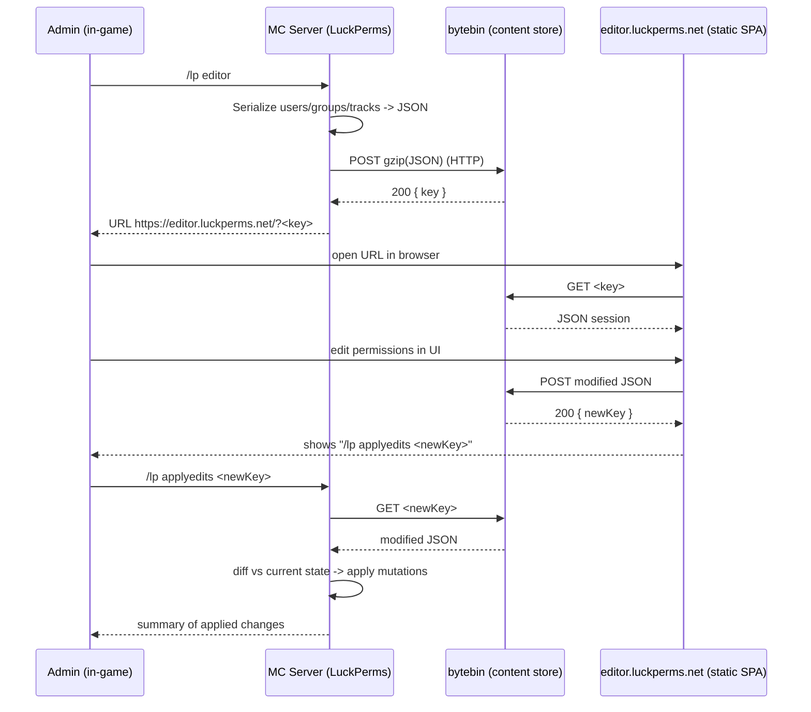

# CustomPerm — Web Admin Panel Design Specification

> **Status:** Design only — not implemented. This document is the reference blueprint for
> building a LuckPerms-style online admin panel ("web editor") for CustomPerm, later.
> **Target loader:** NeoForge 1.21.1 (`neo_version=21.1.221`), Java 21, server-side only.
> **Author:** THEFricadelle
> **No version bump** is implied by this document; versioning happens when implementation starts.

---

## 0. Motivation

CustomPerm already runs in two backends:

- **Standalone / autonomous** — internal grades (`grades.json`), no external dependency.
- **LuckPerms-delegated** — permission checks resolved by LuckPerms; grade subcommands are disabled
  (`CustomPermCommand.warnIfLuckPerms`) and users are managed via `/lp`.

LuckPerms ships a first-class online editor (`/lp editor`). In autonomous mode CustomPerm has **no
equivalent** — admins must use in-game text commands (`/customperm grade ...`, `alias`, `ratelimit`,
`command`) or the optional TesseraUI in-game GUI. The goal is a **web panel comparable to the LP
editor** so autonomous mode reaches feature parity for administration UX, while staying safe and
respecting the mod's "server-side only, never break vanilla clients" guarantee.

---

## 1. Goals & Non-Goals

### Goals
1. Browser-based admin panel to view and edit: grades, user→grade assignments, allow/deny permission
   nodes, exposed commands, aliases (+ steps), rate limits, and settings.
2. Mirror the LuckPerms UX round-trip: `/customperm editor` → URL → edit in browser →
   `/customperm applyedits <code>` in-game.
3. Work in **both** backends: full editing in standalone mode; CustomPerm-owned config only
   (commands/aliases/ratelimits/settings) in LuckPerms mode, delegating grade/user editing to `/lp`.
4. **Server-side only.** No client-side mod requirement; a vanilla client must still connect.
   The panel lives in the admin's browser, fully out-of-band.
5. **Self-hostable** storage + front-end (the mod is proprietary/source-available and exports contain
   player data — see §9).
6. **Safe by construction**: op-2 gated, ephemeral sessions, diff-based apply, input-validated,
   concurrency-aware, all HTTP off the server main thread.

### Non-Goals (v1)
- Replacing `/lp editor` for LuckPerms user/group management.
- Real-time multi-admin collaborative editing (optional future — §6.6, websocket).
- A permanently-listening authenticated web server with accounts (documented as **Option B**, §3, but
  not the recommended v1).

---

## 2. Reference: How the LuckPerms Web Editor Works

The model we mirror. LuckPerms' editor is a **stateless round-trip through a content-storage service**,
not a live connection to the game server.



### Key properties to reproduce
- **bytebin** — a small, open-source (MIT), stateless HTTP content store by lucko. `POST` stores a blob
  (gzip, arbitrary content-type) and returns a short random **key**; `GET /<key>` returns it. Content
  expires after a TTL. **Self-hostable** (Docker). Public instance: `https://bytebin.lucko.me`.
- **webeditor** — an open-source (MIT) static single-page app. No server-side logic; it only talks to
  bytebin. **Self-hostable** (static files). Public instance: `https://editor.luckperms.net`.
- **Authorization** is purely in-game: anyone can *open* a read-only-ish session URL, but only an
  **op** who runs `applyedits` in-game can write changes back to the server. The key is a
  bearer-capability to the *blob*, not to the server.
- **Apply = diff**, not overwrite: the server compares the returned document against current state and
  applies the delta, so concurrent unrelated changes are less likely to be clobbered.
- **(Optional) live sync** — a newer LP feature uses a websocket mediator (`bytesocks`) so the editor
  and server push changes to each other in real time. Out of scope for v1.

---

## 3. Architecture Options

| Option | Summary | Pros | Cons | Verdict |
|---|---|---|---|---|
| **A. bytebin round-trip + static SPA** (mirror LP) | Server exports JSON, uploads to a bytebin, admin edits in a hosted static SPA, `applyedits` downloads + diffs. | No open inbound port; matches a proven model; SPA is trivially self-hostable; minimal server surface; HTTP is short-lived & outbound only. | Requires outbound HTTPS from the server; needs a hosted bytebin + SPA (self or public); not real-time. | **RECOMMENDED for v1.** |
| **B. Embedded local HTTP server + REST API** | The mod runs an authenticated HTTP server exposing a panel + REST endpoints, edited live. | Fully offline/self-contained; live; no third party. | Opens an inbound port (firewall/security surface); needs auth (tokens/sessions), TLS, CSRF handling; larger attack surface; more code. | Documented as an **optional advanced mode** (Phase 6), not v1. |
| **C. In-game GUI only** (extend TesseraUI) | Keep everything in Minecraft screens. | No web at all; already partially built. | Not a "web panel"; limited layout; requires TesseraUI client-side. | Complementary, **not a substitute**. |

**Decision:** implement **Option A**. It reuses a battle-tested, minimal-surface design, keeps the
mod's server-side-only and no-inbound-port properties, and is fully self-hostable to satisfy the
proprietary/privacy constraints. Option B may be added later for air-gapped servers.

---

## 4. End-to-End Flow (Option A, CustomPerm)

New commands (see §11):

```
/customperm editor [section]      # export current config, upload, print editor URL
/customperm applyedits <code>     # download edited doc, diff, apply, resync
```

Flow is identical to §2 with CustomPerm data and CustomPerm's own bytebin/SPA (self-hosted by default).
Two implementation-critical rules:

- **All HTTP runs off the server main thread** (async `HttpClient`), and the **apply step returns to the
  main thread** via `server.execute(...)` before mutating config or the command dispatcher — exactly the
  pattern already used for LuckPerms resync in `LuckPermsService.initServerHooks`. This preserves the
  "checks/mutations happen on the tick thread, and nothing blocks it" invariant.
- **Apply is a validated diff**, never a blind overwrite (see §5.3, §9).

---

## 5. Data Model — Editor Session JSON

### 5.1 Design rules
- **Versioned**: top-level `schemaVersion` (start at `1`). The applier rejects unknown major versions.
- **Backend-aware**: `meta.backend` = `"internal"` | `"luckperms"`. In `luckperms` mode, grade/user
  sections are exported **read-only** (`meta.readOnly` lists them) and the applier refuses to write them.
- **Conflict-detectable**: `meta.configHash` = a stable hash (e.g. SHA-256 over the canonical JSON of the
  current `ConfigSnapshot`). On `applyedits`, if the live config's hash differs from
  `meta.baseConfigHash`, the applier warns and (configurable) either aborts or performs a 3-way merge.
- **Self-describing**: field names map 1:1 to config classes so the exporter/applier stay trivial.

### 5.2 Schema (canonical example)

```json
{
  "schemaVersion": 1,
  "meta": {
    "mod": "customperm",
    "modVersion": "1.0.5",
    "serverName": "My SMP",
    "backend": "internal",
    "exportedAt": "2026-07-27T18:22:05Z",
    "exportedBy": { "uuid": "…", "name": "THEFricadelle" },
    "baseConfigHash": "sha256:…",
    "readOnly": [],
    "sessionNonce": "…random…"
  },
  "grades": [
    { "name": "moderator",
      "allow": ["customperm.command.kick", "customperm.command.ban", "customperm.alias.warn"],
      "deny":  ["customperm.command.stop"] }
  ],
  "users": [
    { "uuid": "…", "name": "Steve", "grades": ["moderator"] }
  ],
  "commands": {
    "granted": ["kick", "ban", "gamemode"],
    "preserveOriginalRequires": { "gamemode": true }
  },
  "aliases": [
    { "name": "warn", "steps": ["tellraw @a {\"text\":\"…\"}", "playsound …"] }
  ],
  "rateLimits": [
    { "command": "gamemode", "enabled": true, "maxExecutions": 5, "windowSeconds": 60 }
  ],
  "settings": {
    "luckPermsFallbackMode": "deny"
  }
}
```

### 5.3 Mapping to config classes

| JSON section | Source (`ConfigSnapshot`) | Notes |
|---|---|---|
| `grades[]` | `GradesConfig.grades` (`Grade.name/permissions/deniedPermissions`) | `allow`←`permissions`, `deny`←`deniedPermissions`. |
| `users[]` | `GradesConfig.userGrades` (UUID→grade list) | `name` best-effort resolved from usercache/online players; informational only. |
| `commands` | `CommandsConfig.grantedCommands` + `preserveOriginalRequires` | |
| `aliases[]` | `AliasesConfig.aliases` (name→steps) | |
| `rateLimits[]` | `RateLimitsConfig.rules` (`Rule.enabled/maxExecutions/windowSeconds`) | |
| `settings` | `SettingsConfig` | Only whitelisted fields (see §9 — never apply arbitrary keys). |

### 5.4 Apply (diff) semantics
For each section, the applier computes **add / remove / change** against the live snapshot and reuses the
existing mutation paths and invariants rather than writing files directly:

- **commands.granted**: added names → same checks as `commandAdd` (command must exist in dispatcher,
  cannot be `customperm`), then `CommandTreeRewriter.repair` + `reassertExposedCommands`; removed names →
  `commandRemove` path (restore original requires). Then one `sendCommands` resync.
- **aliases**: added/changed → `AliasManager.registerOrReplace` + shadowing warning; removed →
  unregister + `repair`.
- **rateLimits**: `RateLimitsConfig.rules` put/remove + `normalize()`.
- **grades/users**: internal-mode only; refuse in LP mode. Reuse `PermissionResolver`-compatible shapes.
- Finally `configManager.save()` + backup (existing atomic write path) + resync.

---

## 6. Server-Side Components (new)

All new classes live under `com.arcadia.customperm.webeditor`.

### 6.1 `WebEditorService` (orchestrator)
- `CompletableFuture<String> createSession(ConfigSnapshot, meta)` → returns editor URL.
- `CompletableFuture<ApplyResult> applyEdits(String code, MinecraftServer)`.
- Owns the `HttpClient`, the config, and thread-hopping discipline.

### 6.2 `EditorSessionExporter`
- Pure function `ConfigSnapshot → JsonObject` (Gson, already a dependency). No Minecraft imports except
  the optional player-name resolution helper (kept injectable for unit tests, like `ConfigManager`).
- Computes `baseConfigHash`.

### 6.3 `EditorSessionApplier`
- `JsonObject → List<Mutation>` (diff) then executes mutations on the **main thread**.
- **Validation gate first** (§9): reject the whole document on any invalid field; never partial-apply
  silently (report which entries were rejected).

### 6.4 `BytebinClient`
- `java.net.http.HttpClient` (JDK built-in — **no new Gradle dependency**).
- `POST` gzip body, `Content-Type: application/json`, `Content-Encoding: gzip`, parse `{ "key": … }`
  (bytebin returns the key in the `Location`/body depending on instance — implement per chosen instance).
- `GET /<key>` → decode.
- Hard **timeouts** (connect + request), **max body size** guard on download, all **async**.
- Base URLs come from config (§10); default points at a self-hosted instance placeholder.

### 6.5 Command wiring
- Extend `CustomPermCommand.register` with `editor` and `applyedits` literals, gated by the **same real-op
  check** already used for the root (`player.createCommandSourceStack().hasPermission(2)`).
- Reuse `RateLimiter` to throttle `editor` (anti-spam on uploads) — dogfoods the existing limiter.

### 6.6 (Optional, later) Live sync
- Websocket mediator (bytesocks-style) for two-way live editing. Additive; not required for v1.

### 6.7 Threading contract (must-hold)
```
editor:      main thread (parse args) → async (export off-thread is fine; it's pure) → async HTTP POST
                → main thread (print URL via server.execute)
applyedits:  main thread (parse args) → async HTTP GET → async validate+diff (pure)
                → main thread (apply mutations + save + resync) via server.execute
```
No blocking network call ever executes inside a Brigadier command callback on the tick thread.

---

## 7. Web Front-End (static SPA)

- **Tech**: a self-contained static site (HTML + vanilla JS or a small framework), no external CDN
  (CSP-friendly), no telemetry. Reuse the visual style already present in
  `assets/customperm/ui/status.html`.
- **Sections**: Grades, Users, Commands, Aliases, Rate Limits, Settings — driven entirely by the session
  JSON; the SPA is schema-version aware.
- **Backend awareness**: when `meta.backend == "luckperms"`, the Grades and Users tabs render read-only
  with a banner: *"Managed by LuckPerms — use `/lp editor`."* Only CustomPerm-owned tabs are editable.
- **Output**: on save, `POST` to the same bytebin and display the exact `/customperm applyedits <code>`
  string to copy.
- **Hosting**: ship the static files in the repo under `webeditor/` and document self-hosting (any static
  host, or bundled with a self-hosted bytebin). We may adapt LP's MIT-licensed `webeditor` as a starting
  point (attribution required; our fork/hosting is compatible with our proprietary mod license since the
  SPA is a separate deliverable).

---

## 8. Dual-Backend Behavior

| Section | Standalone (`internal`) | LuckPerms (`luckperms`) |
|---|---|---|
| Grades | **Editable** | Read-only (delegate to `/lp editor`) |
| Users → grades | **Editable** | Read-only (delegate to `/lp`) |
| Exposed commands | **Editable** | **Editable** (nodes resolved by LP at runtime) |
| Aliases | **Editable** | **Editable** |
| Rate limits | **Editable** | **Editable** |
| Settings | **Editable** | **Editable** |

Defense in depth: even if a tampered document contains grade/user edits while `backend == luckperms`,
the **applier refuses** those sections (mirrors `warnIfLuckPerms` which already blocks grade subcommands).

---

## 9. Security Model

1. **Authorization** — `editor` and `applyedits` require **real op level 2** (reuse the existing
   non-elevated check so an alias running at op-4 cannot self-authorize; see the comment block at
   `CustomPermCommand.register`).
2. **Capability, not identity** — the bytebin key is a bearer capability to a *blob*, never to the server.
   Reading a session grants no server write; only in-game `applyedits` by an op writes.
3. **Ephemerality** — short TTL on bytebin content; random keys; optional `sessionNonce` echoed back and
   verified once, then invalidated (prevents replay of an old `applyedits`).
4. **Transport** — HTTPS required for any non-localhost bytebin. Self-hosting strongly recommended.
5. **Data sensitivity (PII)** — exports contain **player UUIDs and names** and your permission topology.
   Treat as sensitive; default to **self-hosted** bytebin; document that using a public instance uploads
   this data to a third party. `enabled=false` by default (opt-in).
6. **Strict input validation before apply** (never trust fetched content — aligns with the project's
   website-instruction-safety rule): grade/alias/command names against a safe regex; permission nodes
   against the node grammar; alias steps sanitized (no leading slash, no `/customperm` reserved shadowing
   rule already enforced in `aliasAdd`); integer bounds on rate limits (`max>=1`, `window>=1`); reject
   unknown settings keys (whitelist only). Any violation rejects that entry and is reported; the apply is
   all-or-nothing per section where feasible.
7. **Conflict detection** — compare `meta.baseConfigHash` to the live config hash; on mismatch, abort by
   default (configurable to 3-way merge) so a stale editor session can't silently revert newer changes.
8. **Anti-spam** — `editor` is rate-limited (reuse `RateLimiter`) to cap upload frequency per admin.
9. **No inbound port** — Option A never listens; it only makes outbound calls. (Option B would add a
   port and therefore auth/TLS/CSRF requirements — deferred.)

---

## 10. Config Additions

New file `webeditor.json` (kept separate so it hot-reloads and backs up like the others), or a nested
block in `settings.json`. Proposed `WebEditorConfig`:

```json
{
  "enabled": false,
  "bytebinUrl": "https://bytebin.example.com",
  "editorUrl":  "https://customperm-editor.example.com",
  "sessionTtlMinutes": 60,
  "maxDownloadBytes": 2097152,
  "httpTimeoutSeconds": 10,
  "abortOnConcurrentChange": true
}
```

- Add to `ConfigSnapshot`, `ConfigManager` (parse/save/backup like the existing five files), and the
  all-or-nothing reload transaction (INVARIANT-401). Provide `normalize()` with safe defaults.
- **Do not** ship real public URLs enabled by default (privacy + opt-in).

---

## 11. Command Reference (new)

| Command | Op | Effect |
|---|---|---|
| `/customperm editor` | 2 | Export full config, upload, print editor URL. |
| `/customperm editor <section>` | 2 | Same, but the SPA opens focused on `grades\|users\|commands\|aliases\|ratelimits\|settings`. |
| `/customperm applyedits <code>` | 2 | Download edited doc, validate, diff, apply, save, resync; print a change summary. |

Both are also gated by `enabled=true` in `WebEditorConfig`; when disabled they print a hint explaining how
to enable and the privacy implications.

---

## 12. Implementation Plan (phased)

| Phase | Deliverable | Key files | Invariants to preserve |
|---|---|---|---|
| **P1** | Exporter + `BytebinClient` + `/customperm editor` (export & upload only) | `EditorSessionExporter`, `BytebinClient`, `WebEditorService`, command wiring, `WebEditorConfig` | Off-thread HTTP; op-2 gate; opt-in enable. |
| **P2** | `/customperm applyedits` for CustomPerm-owned sections (commands/aliases/ratelimits/settings) | `EditorSessionApplier` (diff), validation | Reuse `commandAdd/Remove`, `AliasManager`, `reassertExposedCommands`, resync. |
| **P3** | Grades + users editing (standalone) | applier grade/user diff | `PermissionResolver` shapes; save/backup. |
| **P4** | LuckPerms-mode read-only + delegation + defense-in-depth refusal | backend gating in exporter/applier | Mirror `warnIfLuckPerms`. |
| **P5** | Static SPA front-end | `webeditor/` | CSP, no external calls except configured bytebin. |
| **P6 (opt.)** | Live websocket sync and/or Option B embedded server | — | Additive; auth/TLS if inbound. |

Each phase ships with tests (§13) and a CHANGELOG entry; **no version bump** until the owner requests one.

---

## 13. Testing Strategy

- **Unit (pure Java, no Minecraft — like `RateLimiterTest`/`PermissionResolverTest`):**
  - Exporter round-trip: `snapshot → JSON → snapshot` is identity for internal mode.
  - `baseConfigHash` stability & sensitivity.
  - Applier diff: add/remove/change per section; all-or-nothing on invalid entry.
  - Validation rejects: bad names, bad nodes, out-of-range limits, unknown settings keys,
    `customperm` shadowing, grade edits under `backend=luckperms`.
  - `BytebinClient` against a **local `com.sun.net.httpserver.HttpServer` stub** (no network).
- **GameTest (`src/gameTest`):** `editor` requires op-2 (non-op denied); `applyedits` mutates the live
  dispatcher and triggers `sendCommands`; conflict-hash mismatch aborts.
- **Security tests:** malformed/oversized payload rejected; replay of a used `sessionNonce` refused.

---

## 14. Risks & Open Decisions (need owner input before implementation)

1. **Bytebin hosting** — self-host (recommended, private) vs use lucko's public `bytebin.lucko.me`
   (uploads player data to a third party; check ToS). *Default in this design: self-host, opt-in.*
2. **SPA origin** — fork LP's MIT `webeditor` (faster, needs attribution) vs build a minimal bespoke SPA
   (full control, more work).
3. **Outbound HTTP** — some servers are firewalled/offline; do we also need Option B (embedded server)
   for those, and when?
4. **PII policy** — is uploading UUIDs/names acceptable at all for this project, or must exports be
   pseudonymized (UUID-only, names resolved locally by the SPA operator)?
5. **Config placement** — separate `webeditor.json` vs nested in `settings.json`.
6. **Conflict policy default** — abort vs 3-way merge on `baseConfigHash` mismatch.

---

## 15. Dependencies & Licensing

- **Server side (Option A): no new Gradle dependency.** Uses JDK `java.net.http.HttpClient` +
  `java.util.zip.GZIPOutputStream` and the already-present Gson.
- **bytebin** (MIT, self-hostable, Docker) — infrastructure, not bundled in the mod jar.
- **webeditor** (MIT) — if adapted, keep the MIT attribution in the SPA; it is a **separate deliverable**
  from the proprietary mod jar and does not affect the mod's license.
- CustomPerm itself remains **proprietary, source-available (All Rights Reserved)**; any self-hosted
  third-party component keeps its own license.

---

## 16. Summary

Adopt the **LuckPerms round-trip model (Option A)**: `/customperm editor` exports a versioned,
backend-aware JSON, uploads it to a (self-hosted) bytebin, and hands the admin a URL to a static SPA;
edits round-trip back and are applied by `/customperm applyedits <code>` as a **validated diff on the main
thread**, reusing every existing mutation path and invariant. This delivers LP-editor-grade
administration for **autonomous mode**, coexists cleanly with LuckPerms mode (read-only there), adds **no
inbound port and no new server dependency**, and is fully self-hostable to satisfy privacy and the
proprietary license. Implementation proceeds in six phases, each tested and changelogged, with the open
decisions in §14 resolved first.
```
